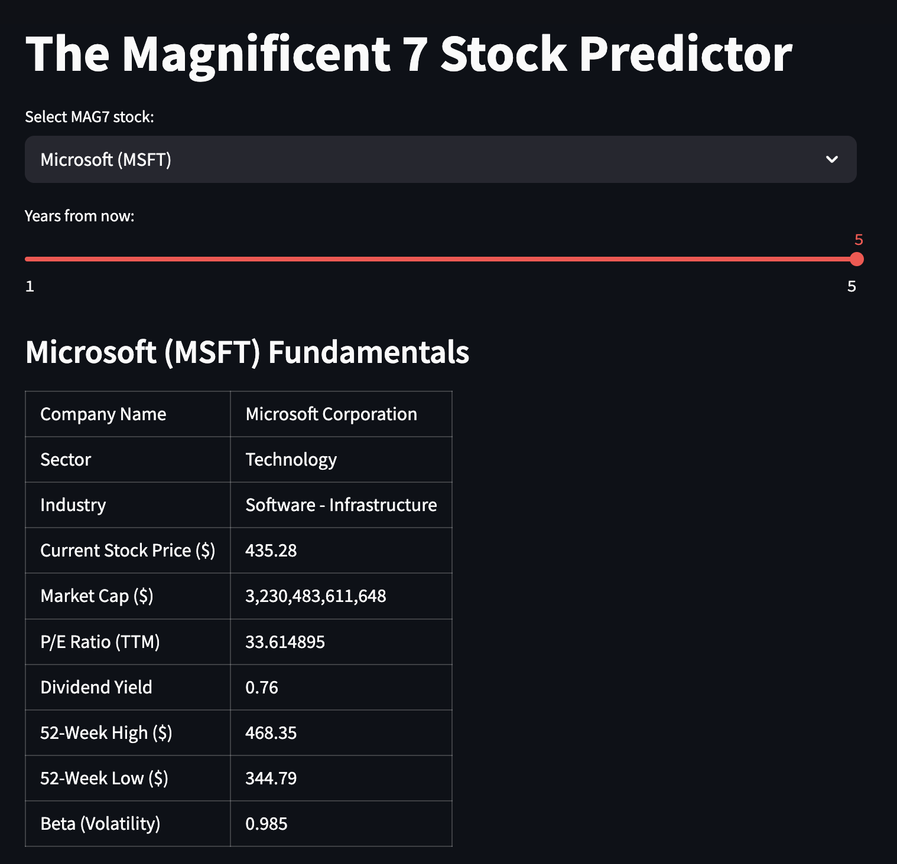
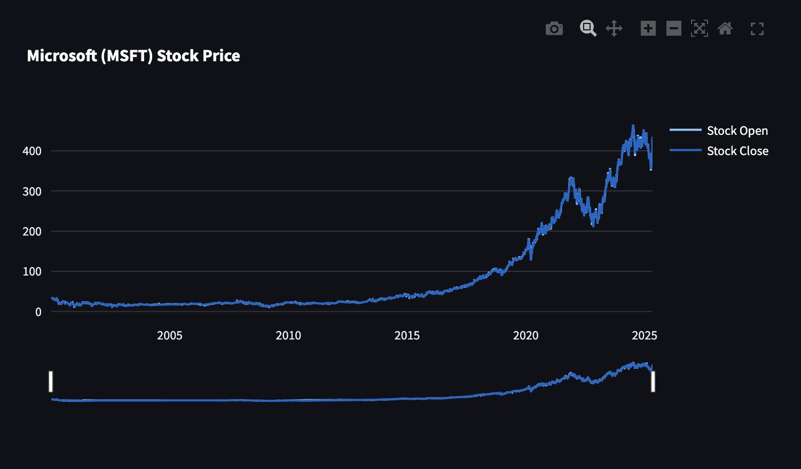

# The Magnificent 7 Stock Predictor

A stock prediction tool that uses Yahoo Finance for stock data and Facebook Prophet to predict future stock prices for the Magnificent 7 stocks (META, AAPL, GOOG, AMZN, MSFT, NVDA, TSLA).

## Features
- Select from Magnificent 7 Stocks
- View stock fundamentals
- Historical price chart with zoom functionality 
- Stock trend forecasting for the next 1-5 years using Facebook Prophet

### Example




## Installation Guide

### Clone the Repository
First, clone the project to your local computer:
```sh
git clone https://github.com/rodmansin/stockpredictor.git
cd stockpredictor
```

### Set Up A Virtual Environment
Create and activate a virtual environment

Mac/Linux (Zsh or Bash):
```sh
python3 -m venv venv
source venv/bin/activate
```
Windows (Command Prompt):
```sh
python3 -m venv venv
venv\Scripts\activate
```
Windows (PowerShell):
```sh
python3 -m venv venv
.\venv\Scripts\activate
```

### Install Dependencies
After activating your virtual environment, install required packages:
```sh
pip install -r requirements.txt
```

### Run the Application
Start the Streamlit app:
```sh
python3 -m streamlit run stock_predictor.py
```